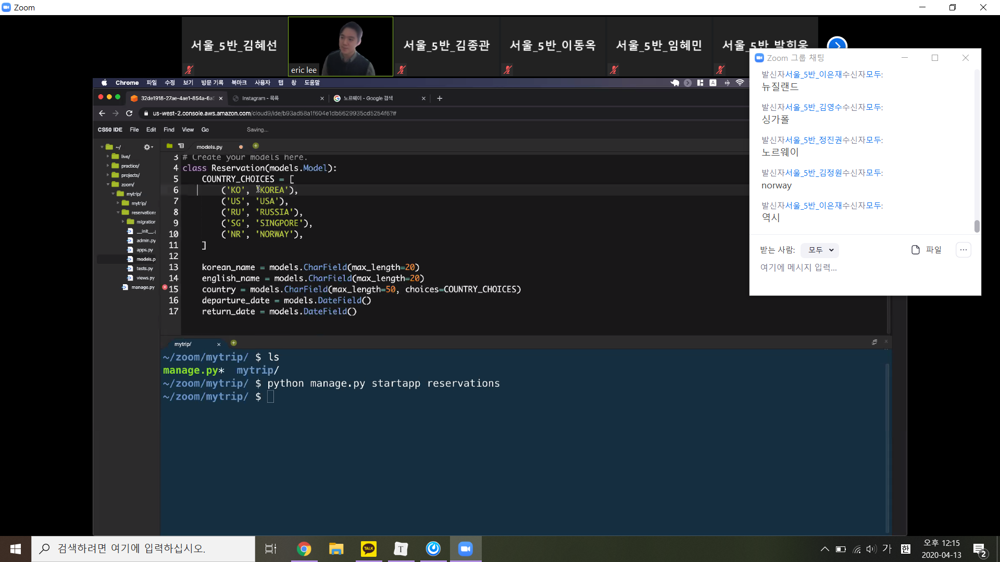
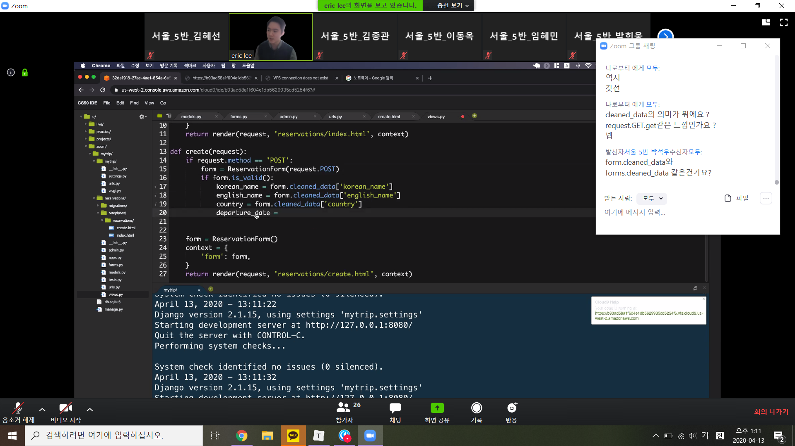
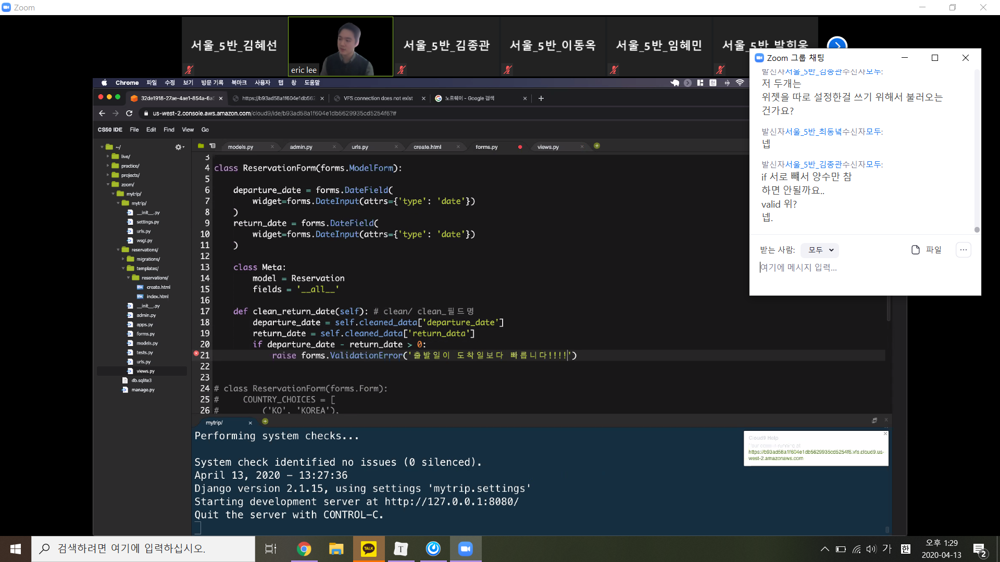
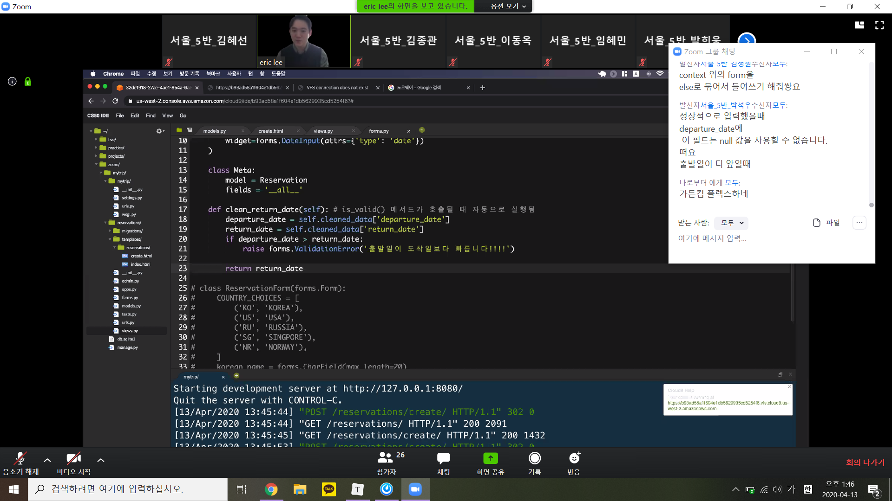

## Django :globe_with_meridians:

### redirect를 사용해서 message를 띄우는 방법

* settings.py 맨 아래에 

```python
MESSAGE_STORAGE = 'django.contrib.messages.storage.session.SessionStorage'
```


choices라는 옵션을 줄 수 있음




### cleaned_data => 검증된 데이터








clean_필드명 => 자동으로 호출됨